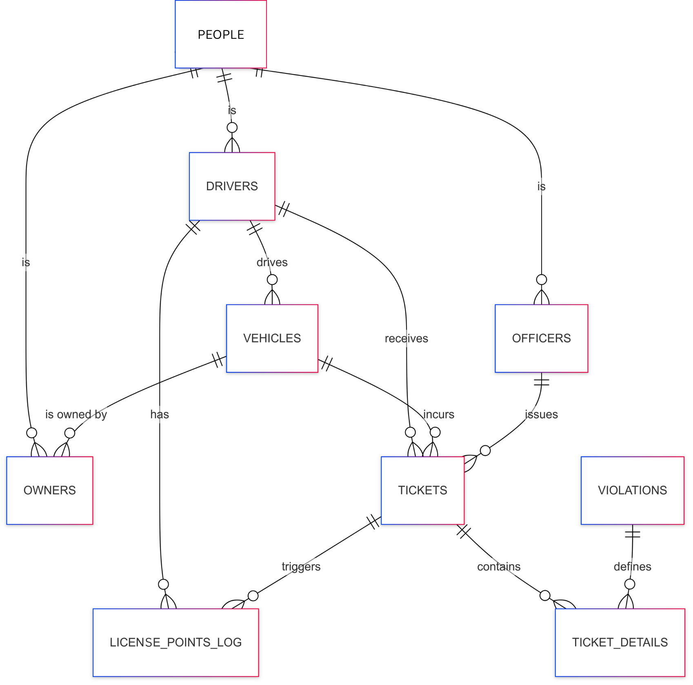

# Design Document

SafeRoads is a database-driven project designed to track road traffic violations and associate them with driver and owner data. Built with structured SQL, it aims to encourage responsible driving by keeping a record of violations for safer roads.

#### Video overview:

## Scope

My project is for a road traffic violation record system.

* It could serve the authorities related to road traffic management of a country.
* It can be used to store the national identities of all the citizens, licenses of the drivers, vehicle owners, vehicle data, police officers, tickets for violations, and the records of drivers' points reduction.
* This system's use would be restricted to a specific country or region. And it should only store the data of citizens who have their government IDs. The data of people below 18, people who were not born in that country or were not issued the government ID are not part of this system.

## Functional Requirements

The system can serve the following purposes:

* Handle any ticket submitted by an officer against a license-holder driver and handle the driving license point reduction and
* Ticket details can be added, including the data of the violation code, driver, vehicle, and officer.

It should not be queried or be modified by non-administrative citizens.

## Representation

Entities are captured in SQLite tables with the following schema.

### Entities

The database includes the following entities:

#### PEOPLE

The `people` table includes:

* `id`, which specifies the unique ID for the person as an `INTEGER`. This column thus has the `PRIMARY KEY` constraint applied.
* `firstname`, which specifies the person's first name as `TEXT`, given `TEXT` is appropriate for name fields.
* `lastname`, which specifies the person's last name. `TEXT` is used for the same reason as `first_name`.
* `father`, which specifies the person's father's name. `TEXT` is used for the same reason as `first_name`.
* `mother`, which specifies the person's mother's name. `TEXT` is used for the same reason as `first_name`.
* `dob`, which specifies the person's date of birth. Dates in SQLite can be conveniently stored as `NUMERIC`, per SQLite documentation at <https://www.sqlite.org/datatype3.html>.
* `blood_group`, which specifies the person's blood group. `TEXT` is used for the same reason as `first_name`.
* `nid`, which specifies the person's government-issued national identity number. `INTEGER` is used because it could be an integer. However, different countries might have different types of NID numbers that could contain alphabets. A `UNIQUE` constraint ensures no two persons have the same NID number.
* `address`, which specifies the person's permanent address. `TEXT` is used for the same reason as `first_name`.
* `birthplace`, which specifies the person's birth district. `TEXT` is used for the same reason as `first_name`.

#### DRIVERS

The `drivers` table includes:

* `id`, which specifies the unique ID for the driver as an `INTEGER`. This column thus has the `PRIMARY KEY` constraint applied.
* `person_id`, which is the person ID of the driver corresponding to the people table as an `INTEGER`. This column thus has the `FOREIGN KEY` constraint applied, referencing the `id` column in the `people` table to ensure data integrity.
* `license_no`, which specifies the driver's government-issued driving license number. TEXT is used because license numbers may contain both letters and digits. A `UNIQUE` constraint ensures no two persons have the same license number.
* `issue_date`, which is the date at which the driving license was issued, making `NUMERIC` the ideal type for.
* `expiry_date`, which is the expiry date of the driving license, `NUMERIC` being the type.
* `status`, active, expired, or suspended status for the license as a `TEXT`.
* `current_points`, which stores the current points of the license as an `INTEGER`.

#### OWNERS

The `owners` table includes:

* `id`, which specifies the unique ID for the owner as an `INTEGER`. This column thus has the `PRIMARY KEY` constraint applied.
* `person_id`, which is the person ID of the owner corresponding to the people table as an `INTEGER`. This column thus has the `FOREIGN KEY` constraint applied, referencing the `id` column in the `people` table to ensure data integrity.
* `vehicle_id` , which is the vehicle ID of the owner corresponding to the vehicles table as an `INTEGER`. This column thus has the `FOREIGN KEY` constraint applied, referencing the `id` column in the `vehicles` table to ensure data integrity.
* `percent_share`, which is the owner's percent share of the related vehicle as an `INTEGER`, the default value being 100.
* `from_date`, the date when the owner owned the related vehicle as a `NUMERIC` type value.

#### OFFICERS

The `officers` table includes:

* `id`, which specifies the unique ID for the officer as an `INTEGER`. This column thus has the `PRIMARY KEY` constraint applied.
* `person_id`, which is the person ID of the officer corresponding to the people table as an `INTEGER`. This column thus has the `FOREIGN KEY` constraint applied, referencing the `id` column in the `people` table to ensure data integrity.
* `badge_no`, which specifies the officer's badge number. `INTEGER` is used because it could be an integer. However, different countries might have different types of badge numbers that could contain alphabets. A `UNIQUE` constraint ensures no two officers have the same badge number.
* `station`, which specifies the officer's station as a `TEXT`.
* `rank`, which specifies the officer's rank as a `TEXT`.

#### VEHICLES

The `vehicles` table includes:

* `id`, which specifies the unique ID for the vehicle as an `INTEGER`. This column thus has the `PRIMARY KEY` constraint applied.
* `plate_no`, which specifies the vehicle's unique plate number. `TEXT` is used because it could contain alphabets and numbers.
* `reg_year` is the registration year of the vehicle as `INTEGER`.
* `make` indicates the manufacturer of the vehicle as `TEXT`.
* `model` contains the model number of the vehicle as `TEXT`.
* `color` contains the color of the vehicle as `TEXT`.
* `chassis_no` contains the chassis number of the vehicle as `TEXT`.
* `engine_no` contains the engine number of the vehicle as `TEXT`.
* `manufacture_year` is the manufacture year of the vehicle as `INTEGER`.
* `vehicle_type` contains the vehicle type as `TEXT`.

#### TICKETS,

The `tickets` table includes:

* `id`, which specifies the unique ID for the ticket as an `INTEGER`. This column thus has the `PRIMARY KEY` constraint applied.
* `datetime`, which is the `NUMERIC` date and timestamp at which the ticket was issued.
* `location`, which specifies the location of the ticket issuance as `TEXT`.
* `officer_id`, which is the ID of the officer who issued the ticket, as an `INTEGER`. This column thus has the `FOREIGN KEY` constraint applied, referencing the `id` column in the `officers` table to ensure data integrity.
* `driver_id`, which is the ID of the driver corresponding to the drivers table as an `INTEGER`. This column thus has the `FOREIGN KEY` constraint applied, referencing the `id` column in the `drivers` table to ensure data integrity.
* `vehicle_id`, which is the ID of the vehicle corresponding to the vehicles table as an `INTEGER`. This column thus has the `FOREIGN KEY` constraint applied, referencing the `id` column in the `vehicles` table to ensure data integrity.

#### TICKET_DETAILS

The `ticket_details` table includes:

* `ticket_id`, which specifies the unique ID for the ticket as an `INTEGER`. This column thus has the `PRIMARY KEY` constraint applied.
* `violation_code`, which specifies the unique violation code for the ticket as an `INTEGER`. This column thus has the `FOREIGN KEY` constraint applied, referencing the `violation_code` column in the `violations` table to ensure data integrity.
* `quantity`, which is the number of times the related violation was committed as an `INTEGER`, the default value being 1.

#### VIOLATIONS

The `violations` catalogue includes:

* `violation_code`, which specifies the unique code for the violation as an `INTEGER`. This column thus has the `PRIMARY KEY` constraint applied.
* `points_deduct`, which specifies the deductable points for each violation as an `INTEGER`.
* `description`, which describes the related road traffic violation as an `TEXT`.
* `fine_amount`, which is the fine amount for each violation as an `INTEGER`,

#### LICENSE_POINTS_LOG

The `licence_points_log` table includes:

* `id`, which specifies the unique ID for this table as an `INTEGER`. This column thus has the `PRIMARY KEY` constraint applied.
* `driver_id`, which is the ID of the driver corresponding to the drivers table as an `INTEGER`. This column thus has the `FOREIGN KEY` constraint applied, referencing the `id` column in the `drivers` table to ensure data integrity.
* `ticket_id`, which is the ID of the ticket corresponding to the tickets table as an `INTEGER`. This column thus has the `FOREIGN KEY` constraint applied, referencing the `id` column in the `tickets` table to ensure data integrity.
* `points_before`, which specifies the previous points of the drievr as an `INTEGER`.
* `points_change`, the change in points to the driving license as an `INTEGER`.
* `points_after`, the final points of the driving license as an `INTEGER`.
* `processed_at`, which is the `NUMERIC` date and timestamp at which the points was changed.

### Relationships

The below entity relationship diagram describes the relationships among the entities in the database.

As detailed by the diagram:

* All the owners, drivers and officers are people. All the people may not be the others, vice-versa.
* Each vehicle can be owned by multiple owners and can be linked to zero or more drivers.
* For any traffic violation, an officer can issue a ticket whether or not the vehicle or the driver is detected.
* Later, ticket details can be added in accordance with the definitions of road traffic
violations.
* The ticket details can trigger the allocated driver's license points, after keeping a log.

## Optimizations

Indexes are created so that—

* Typically, driving license number is used to detect a driver.
* Tickets might be retrieved by the ID of drivers, vehicles, or officers.
* Vehicles are usually identified by its plate number.
* Owners are often related to the person or the vehicle.
* Drivers and officers are also related to the person.
* Ticket ID is used to find ticket details.
* While reducing license points, the related violation code is used.
* ID of drivers and tickets are used while reducing points.

Similarly, for easily accessing the information related to any tickets, the `ticket_details_view` view is created.

## Limitations

* My design is not able to include any photographs of any taffic violation related to any ticket.
* My database might to represent the services of issuing any national or onternational learner's driving license or driving license.
* Nor it is related to any vehicle's registration certificate, road permit, tax token or fitness certificate.

© 2025 Marjuk Sajid

This project is dedicated to the public domain under the Creative Commons CC0 1.0 Universal Public Domain Dedication.

You are free to copy, modify, distribute, and perform the work, even for commercial purposes, without asking permission.

If you use or modify this work, mentioning the original author is appreciated but not required.
